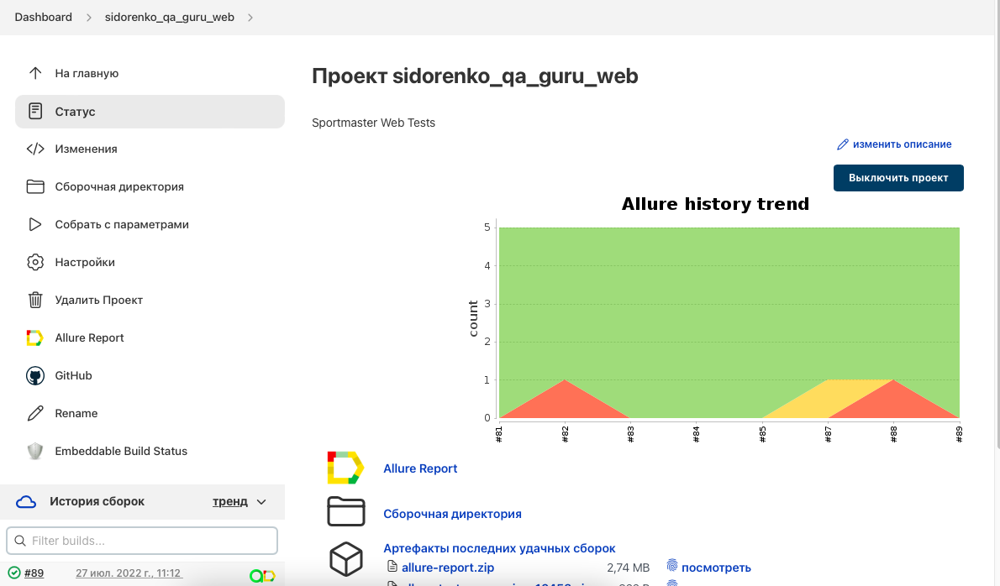
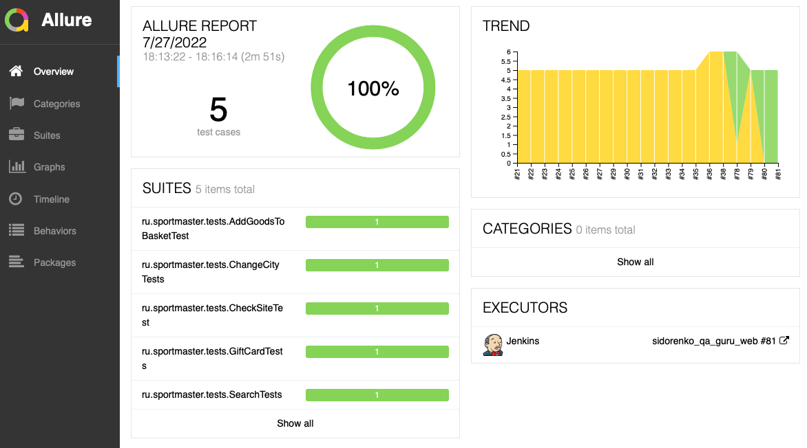
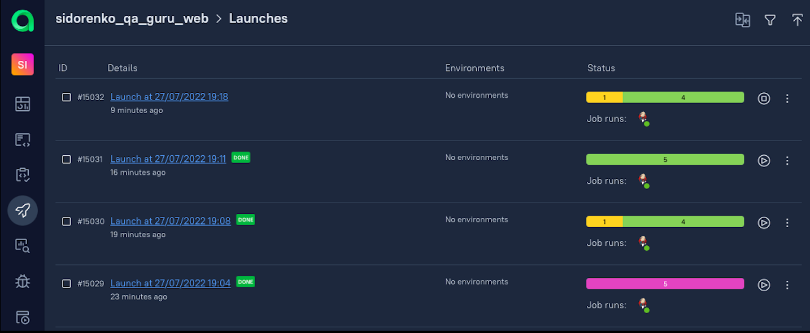
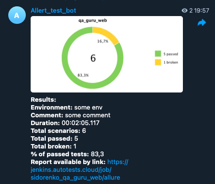

# Проект автоматизации тестирования для http://sportmaster.ru


##  Используемые инструменты

<p align="center">


</p>

>В данном проекте автотесты написаны на <code>Java</code> с использованием <code>Selenide</code> для UI тестов.
> 
> В качестве библиотеки для модульного тестирования используется <code>JUnit 5</code>.
>
> Для автоматизированной сборки проекта используется <code>Gradle</code>.
>
> <code>Selenoid</code> выполняет запуск браузеров в контейнерах <code>Docker</code>.
>
> <code>Allure Report</code> формирует отчет о запуске тестов.
>
> <code>Jenkins</code> выполняет запуск тестов.
>
> После завершения прогона отправляются уведомления с помощью бота в <code>Telegram</code>.

## Запуск тестов
<details>
<summary>Подробнее ...</summary>

### Локальный запуск тестов

```./gradlew clean test```

### Локальный запуск тестов в Selenoid
<details>
<summary>Шаги запуска</summary>

>1. Создать файл с проперти
>> * путь указать ```./src/test/resources/config/remoteBrowser.properties```
>> * добавить данные в файл, пример( ```src/test/resources/config/exampleRemoteBrowser.properties``` )
>2. Запустить тесты
>>```./gradlew clean test -DselenoidURL=${SELENOIDURL}```
</details>


### Удаленный запуск тестов в Jenkins
<details>
<summary>Шаги запуска</summary>

>1. Создать файл с проперти в Jenkins
>> * путь указать ```./src/test/resources/config/remoteBrowser.properties```
>> * добавить данные в файл, пример( ```src/test/resources/config/exampleRemoteBrowser.properties``` )
>2. Создать файл с настройками для Telegram в Jenkins
>> * путь указать ```./notifications/telegram_config.json```
>> * добавить данные в файл, пример(```./notifications/example_telegram_config.json```)
>3. Запустить тесты
>>```
>>clean
>>test
>>-DselenoidURL=${SELENOIDURL}
>>```
</details>
</details>


# Пример запуска тестов Jenkins и отчеты
##  Главная страница сборки Jenkins

<p align="center">
  
</p>

##  Отчет о результатах тестирования в Allure Report

### Главная страница Allure-отчета

<p align="center">

</p>

### Страница с тестами

<p align="center">

</p>

##  Отчеты в TestOps

<p align="center">


</p>


##  Уведомления в Telegram с использованием бота

> После завершения сборки бот, созданный в <code>Telegram</code>, автоматически обрабатывает и отправляет сообщение с отчетом.
<p align="center">

</p>


